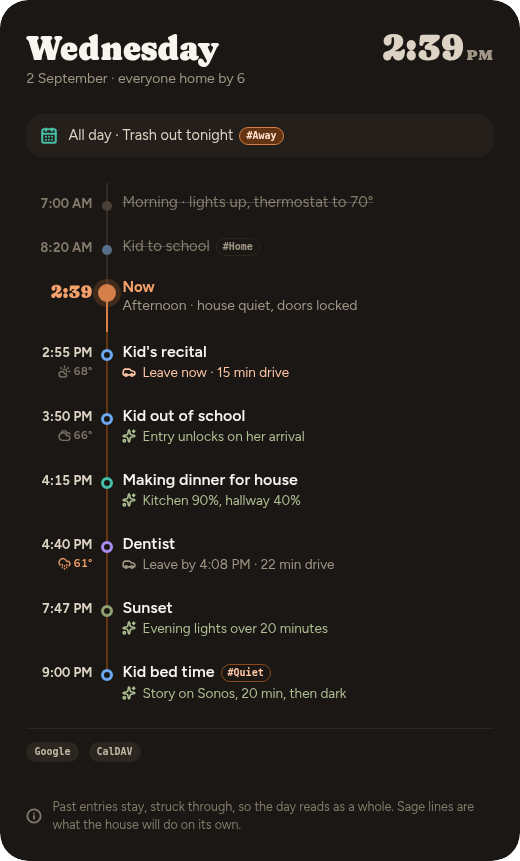

# Dayline

A Home Assistant dashboard card that renders **today as one vertical spine** —
calendar events, sun times, scheduled automations and actionable to-dos merged
into one chronological list with a live "now" marker.

It answers two questions at a glance, without interaction: *what is left of
today?* and *what will the house do without me?*

Past entries stay, struck through, so the day reads as a whole. Things the house
will handle on its own are annotated in sage, in plain words — "Entry unlocks on
her arrival", never a scene name.



## Why this exists

Nothing in core Lovelace or HACS merges calendar + sun + automation intent into
one annotated, time-sorted spine. `calendar` cards list events.
`atomic-calendar-revive` comes closest but has no notion of automation intent
and no now-marker positioned within the day. `Chronicle Card` merges sources but
is logbook-oriented — it tells you what happened, not what is about to.

## What it does

- **Merges** calendars, `sun.sun`, schedule calendars and to-do lists into one
  ordered day, deduping near-identical events across calendars.
- **Says what the house will do**, in sentences a person wrote, not entity ids.
- **Shows what is running now** — several things at once if that is the truth —
  each with a progress bar, time remaining and end time.
- **Keeps actionable items until they are done.** "The washer is full" stays on
  the card, with a button, until someone presses it. It does not quietly slide
  into the past and go mouldy.
- **Explains what just happened.** "Living room lights turned off by motion
  sensor", for five minutes, so nobody has to wonder.
- **Joins the hourly forecast** to upcoming entries — you are going to the fair,
  and it will be raining.
- **Never hides anything silently.** What the density budget collapses is
  counted on a `+N more today` row. A stale calendar tints its own pill and says
  so in the footer. The card states what it does not know.

## Installing

**HACS → ⋮ → Custom repositories**, add `https://github.com/bitmux/Dayline`
with category **Integration**, download it, restart Home Assistant, then
**Settings → Devices & services → Add integration → Dayline**.

Setup asks for your calendars and nothing else that matters. The card ships with
the integration and registers itself, so there is **one** repository to add and
no Resources page step — Dayline is not a second, separate HACS "Dashboard"
entry.

Full instructions, the YAML alternative, and every card option:
**[INSTALL.md](INSTALL.md)**.

## How it is put together

Two halves, joined by one contract: an ordered list of entries on a sensor's
attributes.

```
custom_components/day_spine/   the feed — fetches, merges, decides
  merge.py                     all the decisions, zero HA imports (so: testable)
  coordinator.py               fetching, and the fast path for house events
  config_flow.py               setup and the options UI
src/                           the card — renders, decides nothing
  day-spine-card.ts            the Lit element
  styles.ts                    the design system, transcribed
ha/day_spine.yaml              the same feed as a template-sensor package
design/                        the original design reference and screenshots
```

**The card is dumb on purpose.** It takes a list and draws it. Every decision
that will change over time — which calendars count, what an entry's priority is,
what "mark done" actually calls — is data the feed supplies. Actions are
service-call descriptors written by the feed, so pointing the Done button at
Grocy instead of `todo` later is a config change, not a card rebuild.

## Working on it

```bash
npm install && npm run build
npx tsc --noEmit
.venv/bin/python -m pytest tests -q
.venv/bin/python tools/check-flow.py
```

`dev/index.html` renders every state of the card side by side with no Home
Assistant involved — serve it over HTTP (`python3 -m http.server 8765`) rather
than opening the file, since it loads its fixtures by fetch — including panels fed by the real merge output of both the
integration and the YAML package. Its clock is pinned to 2:39 PM so it
reproduces the design reference whenever you open it.

## Status

Early, but real: installed through HACS on a live Home Assistant 2026.8, config
flow clicked through, drawing a live day from Local Calendar, a to-do list and
the National Weather Service. Three bugs that only a live instance could show —
a sunset dropped by a UTC date rollover, rain that never rendered as rain on the
default weather provider, and events spanning midnight landing at the wrong end
of the day — were found that way and are covered by tests.

Not built yet: drag-to-reschedule, a visual editor for the card's own options,
and the security/awareness variants sketched in `design/`.
