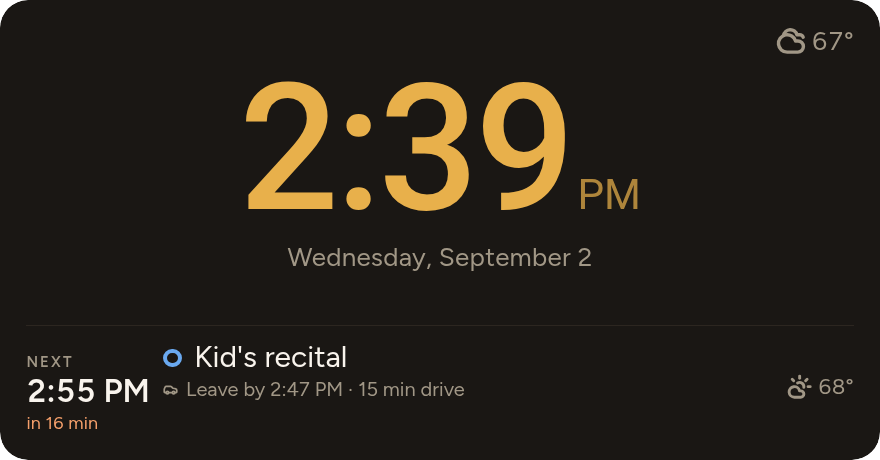

# Dayline

I got tired of reading my calendar card, my to-do card, my weather card, sunrise & sunset, and my “did the house do the thing” card taking up so much of my dashboard. I’m on a quest to go hardcore minimalist on my dashboards. Designed as a full-height sidebar, Dayline puts today on a single vertical timeline: calendar events (with hourly forecast icon), sunrise and sunset, to-dos, and what my automations are going to do or did on their own, all in time order with a marker for now.


Good for people who live primarily by their calendar.  Vibeslopped together with Claude, if it triggers your HA controlled pyrotechnics unexpectedly, that’s a you problem, you’ve been appropriately informed.

It answers a few questions at a glance, without interaction: *what is next, what's left of today?* *what just happened?* and *what will the house do without me?*


#tag items can fire automations direct from your calendar. If you have a shared calendar, caution. 2 layers: First you have to tag the calendar you wish to offer control permissions to with “#Dayline Control”, second you have to create the automation with Dayline #tag as a trigger. I rather like the idea combined with a mode selector. #Away sets my master house mode to away. Additional caution, if someone sends you a calendar invite with a #tag in it that just so happens to match an autometion, which you haven’t even accepted yet, I don’t know what will happen.

I live by my calendar and its on a private server local to my lan anyway, so just adding a #tag to my normal daily events is a sick way to automate. if I just move my “wake up” calendar event, with the #wake tag, it sets my alarm automation for me.

Therefore, if you like a little more security: the concept of a house control calendar as a local ha calendar to which no one will send invites, is included. Instead of time helpers or raw time triggers in your automations, you can simply make local calendar entries with
tags in them corresponding to when you’d like various automations to fire. Then you can have a single calendar gui for modifying when your house makes automatic changes.

If a calendar event has a location, it asks Waze what the drive time is from a configurable start location (defaults to zone.home) at the start time of the event. It then tells me when to walk out the door. No API key or account attached (so far?). You could also insert person.name and if there’s a companion app associated with that person it’ll work from wherever their device is. There’s also a ‘buffer time’ - it seems to take me 15 minutes to actually get out the door for anything, so I build that in.

There’s a second glance card in the same bundle for wall tablets (View Assist): a big clock, whatever’s next, and anything currently wrong, and the clock quietly goes amber and then red as a leave-by time approaches. I chose to replace the entire clock card on my View Assist config with this glance card, though I intentionally did not include all the view assist magic. Its about 8 lines of yaml as opposed to VA’s rather complicated page, I accept the loss of functionality because my card replaces most of it for me (I’m not interested in touch controls on my glance devices, voice and eyeballs only).

Cards are driven by the integration, which is gathering all the data and pushing it to the cards, read the docs, its kinda cool?

There are several cross-paradigm inconsistencies, (do we use a #tag here or a direct automation or is it a config option in the settings?) There might even be a couple items in the integration settings dialog that flat don’t work, I’ll probably fix those eventually

Claude did rather well though it made some interesting visual design choices, I ended up just using the HA theme (dark glass lite) in my production instance.

And the same feed on a wall panel, sixteen minutes before it is time to set off
for the recital. The clock is the warning; the line underneath still says it in
words.



## What it does (Klaudevibe-jargon follows)

- **Merges** calendars, `sun.sun`, schedule calendars and to-do lists into one
  ordered day, deduping near-identical events across calendars.
- **Says what the house will do**, in sentences a person wrote, not entity ids.
- **Shows what is running now** — several things at once if that is the truth —
  each with a progress bar, time remaining and end time.
- **Keeps actionable items until they are done.** "The washer is full" stays on
  the card, with a button, until someone presses it.
  
- **Explains what just happened.** "Living room lights turned off by motion
  sensor", for five minutes, so nobody has to wonder.
- **Says when to leave.** When an event names a place, Dayline prices the drive
  *at the time you would be driving it* and works back from the start: "Leave by
  4:08 PM · 22 min drive", turning terracotta once that time has gone. It uses
  Home Assistant's own Waze Travel Time component — no account, no API key,
  nothing to install — and it is off until you turn it on, because it is the one
  thing here that talks to a server outside the house.
- **Joins the hourly forecast** to upcoming entries — you are going to the fair,
  and it will be raining.
- **Wears your theme, or brings its own.** A card you add starts with
  `use_ha_theme: true`, taking its colours *and its surface* from the active
  Home Assistant theme — a frosted theme's blur, shadow and border included, so
  it is made of the same material as the cards beside it. Delete that line for
  the Organic palette: warm dark ground, terracotta now-marker, sage for
  anything the house does on its own. The geometry and typefaces stay put
  either way, so it is the same card in either dress.
- **Configured with labels, not forms.** The `Dayline` label puts a calendar on
  the spine; `Dayline Control` lets that calendar's `#tags` act; a `#tag` in an
  event title fires an event you bind to anything you like with the shipped
  blueprint. See [INSTALL.md](INSTALL.md#labels-and-tags--where-the-settings-went).
- **Comes with a second card for a wall.** **Dayline Glance** is the same feed
  reduced to a clock, the one event that matters next with its leave-by time,
  and up to two live alerts. The clock itself goes amber as that leave-by time
  approaches and red once it has gone, so a panel being ignored across the room
  still gets your attention without a new element appearing on it. While
  something is running it shows how much of it is left and names what follows;
  the weather sits in the corner, and the forecast for the event it is naming
  sits beside that event. Everything is sized to be read from eight feet away,
  and when it does not all fit the card gives things up in a deliberate order
  rather than being cut off by a panel that cannot scroll. Same bundle, nothing
  extra to install.
- **Never hides anything silently.** What the density budget collapses is
  counted on a `+N more today` row. A stale calendar tints its own pill and says
  so in the footer. The card states what it does not know.

## Installing

Dayline is **two HACS repositories**, because Home Assistant treats a backend
integration and a frontend card as separate things and installing them is two
separate steps.

| | Repository | HACS category |
|---|---|---|
| The feed — decides what to show | this one | **Integration** |
| The card — draws it | [bitmux/Dayline-card](https://github.com/bitmux/Dayline-card) | **Dashboard** |

**HACS → ⋮ → Custom repositories**, add both. Download both, restart Home
Assistant, then **Settings → Devices & services → Add integration → Dayline**.
Setup asks for your calendars and nothing else that matters.

Full instructions, the YAML alternative, and every card option:
**[INSTALL.md](INSTALL.md)**. Where this is going, and the principles that
decide the arguments: **[ROADMAP.md](ROADMAP.md)**.

```
custom_components/day_spine/   the feed — fetches, merges, decides
  merge.py                     all the decisions, zero HA imports (so: testable)
  coordinator.py               fetching, and the fast path for house events
  config_flow.py               setup and the options UI
src/                           the card — renders, decides nothing
  day-spine-card.ts            the Lit element
  styles.ts                    the design system, transcribed
ha/day_spine.yaml              the same feed as a template-sensor package
design/                        the original design reference and screenshots
```

**The card is dumb on purpose.** It takes a list and draws it. Every decision
that will change over time — which calendars count, what an entry's priority is,
what "mark done" actually calls — is data the feed supplies. Actions are
service-call descriptors written by the feed, so pointing the Done button at
Grocy instead of `todo` later is a config change, not a card rebuild.

## Working on it

```bash
npm install && npm run build
npx tsc --noEmit
.venv/bin/python -m pytest tests -q
.venv/bin/python tools/check-flow.py
```

`dev/index.html` renders every state of the card side by side with no Home
Assistant involved — serve it over HTTP (`python3 -m http.server 8765`) rather
than opening the file, since it loads its fixtures by fetch — including panels fed by the real merge output of both the
integration and the YAML package. Its clock is pinned to 2:39 PM so it
reproduces the design reference whenever you open it.

## Status — Alpha

Alpha in the honest sense: everything described above works and is running, but
it has been through one instance. Expect failures and frequent updates.

Not built yet: drag-to-reschedule, a visual editor for the card's own options,
and the security/awareness variants sketched in `design/`. Untested against
Google/CalDAV calendars, recurring events, and any weather provider other than
NWS and met.no.
